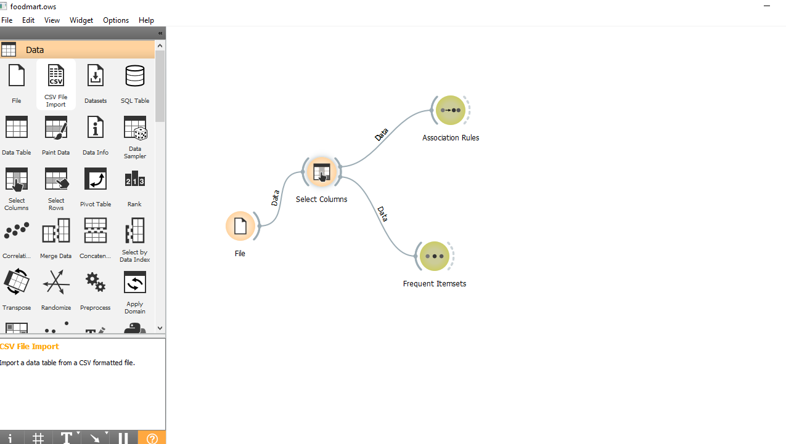
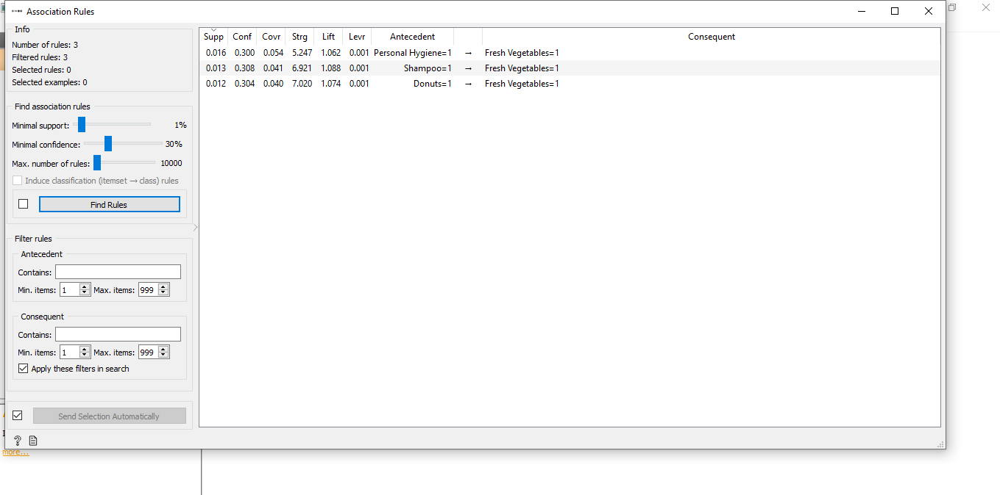
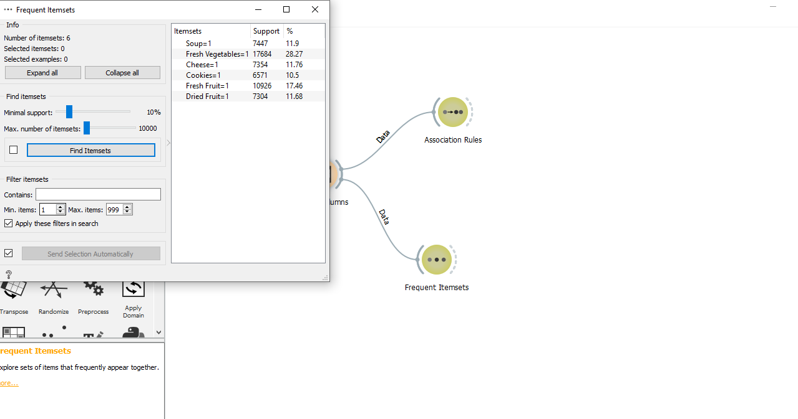
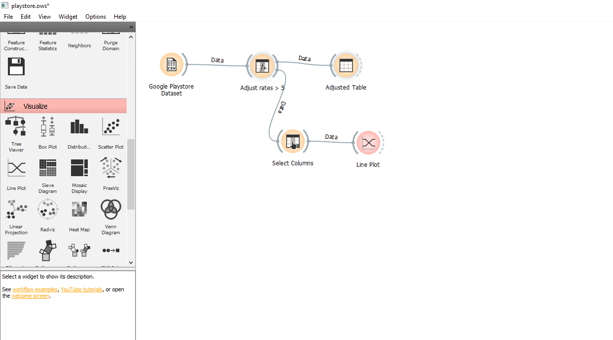
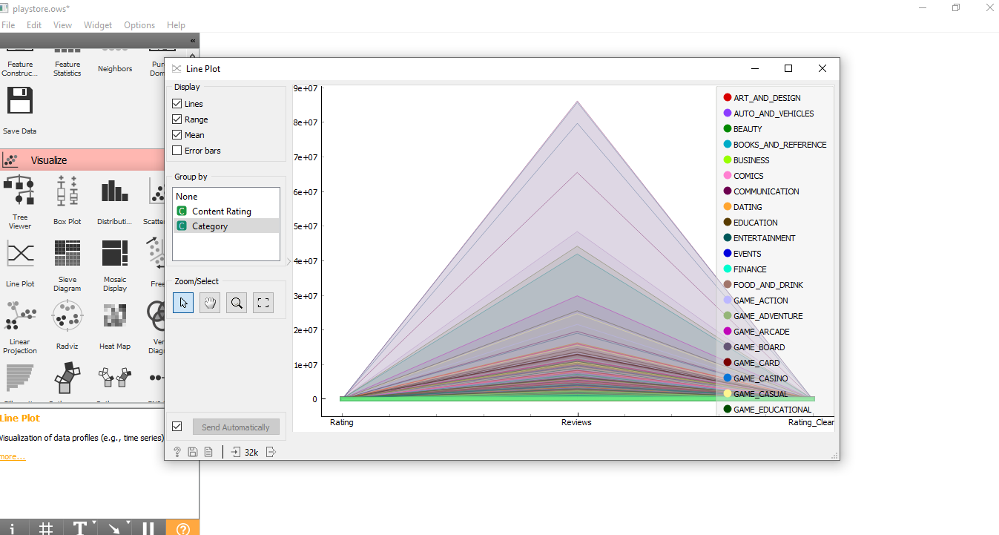
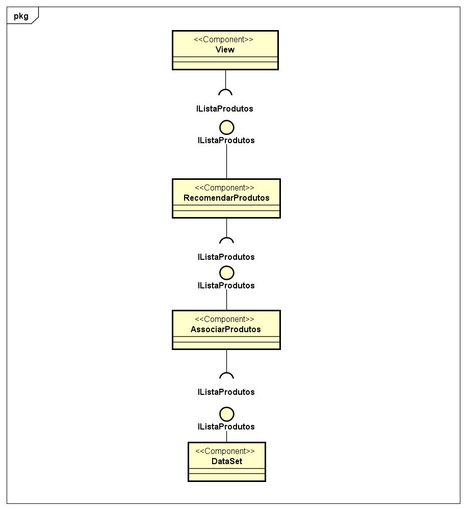
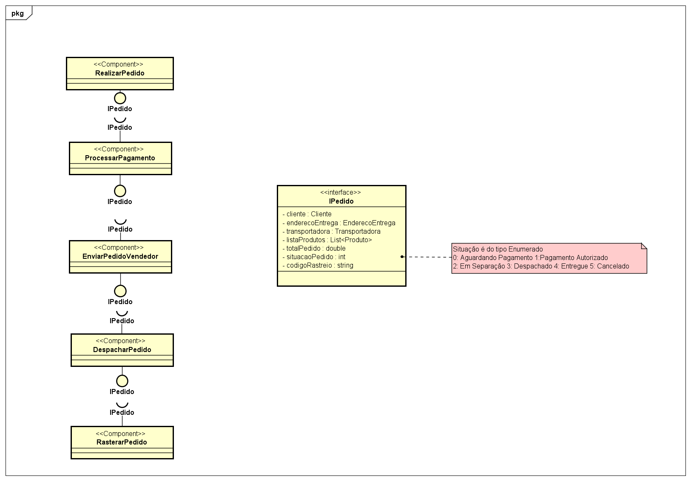

## Lab01 - Data Flow

### ALUNO
   >Renan Alves da Silva
  

## Projeto Orange / Regras de Associação para Foodmart
### Imagens do Projeto
  
  
  
  
  
## Arquivo do Projeto

  
## Projeto Orange / Análise de Dados do Google PlayStore
  
  
  
## Arquivo do Projeto

  
## Projeto de Composição de Componentes para Recomendação
  
### Imagens do Projeto
  
 ## Projeto de Composição de Componentes para Pedido
  
### Imagens do Projeto
  
