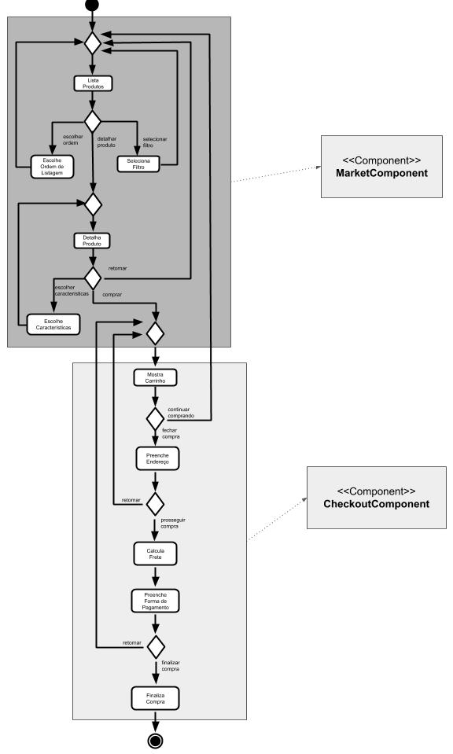
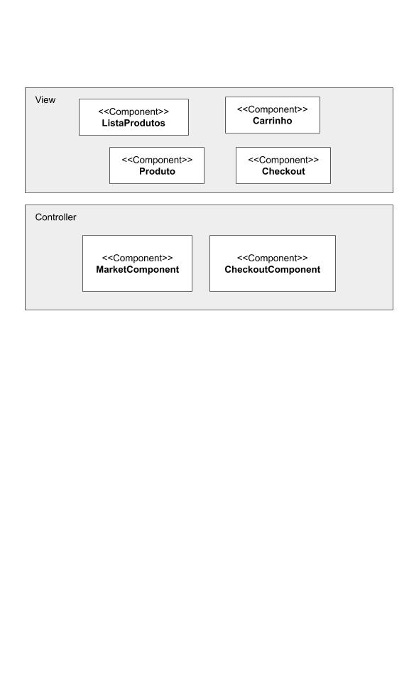
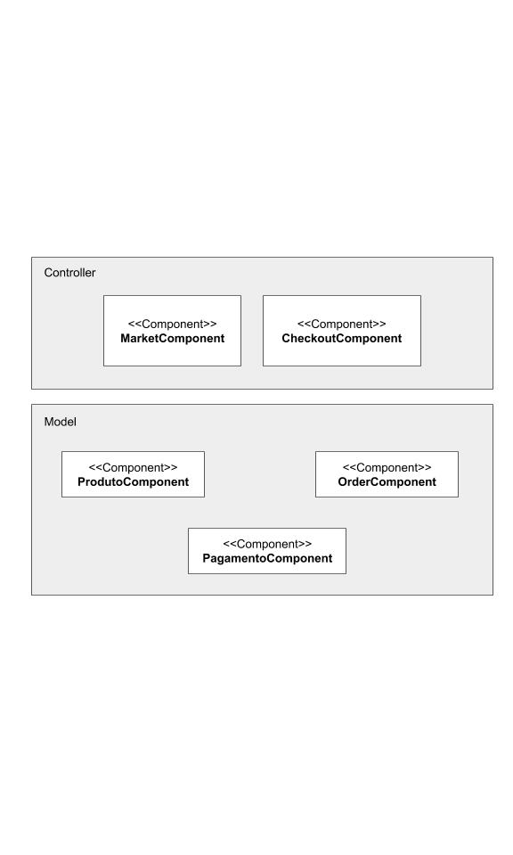

## Modelo para Apresentação do Lab04 - Serviços

### ALUNO
   >Renan Alves da Silva
  

## Tarefa 1
  
## Tarefa 2
  
## Tarefa 3
  
## Tarefa 4
### Serviço Exemplo

* **Título do serviço**: `XKCD`
* **Breve descrição**:
  Serviço que recebe o número de uma das tirinhas do XKCD e retorna os dados da tirinha e a URL para a sua imagem.
* **URL completa da requisição**: `http://xkcd.com/35/info.0.json`
* **Cabeçalho HTTP da chamada**:
~~~http
GET /http://xkcd.com/35/info.0.json HTTP/2
Host: any-api.com:8443
User-Agent: Mozilla/5.0 (X11; Ubuntu; Linux x86_64; rv:79.0) Gecko/20100101 Firefox/79.0
Accept: */*
Accept-Language: pt-BR,pt;q=0.8,en-US;q=0.5,en;q=0.3
Accept-Encoding: gzip, deflate, br
Origin: https://any-api.com
Connection: keep-alive
Referer: https://any-api.com/xkcd_com/xkcd_com/console/_comicId_info_0_json/GET
~~~
* **Cabeçalho HTTP da resposta**:
~~~http
access-control-allow-origin: *
age: 0
cache-control: max-age=300
content-encoding: br
content-type: application/json
date: Sat, 22 Aug 2020 20:22:49 GMT
etag: W/"5f3f46c3-1e8"
expires: Sat, 22 Aug 2020 20:27:49 GMT
last-modified: Fri, 21 Aug 2020 04:00:03 GMT
server: cloudflare
vary: Accept-Encoding
via: 1.1 varnish
x-cache: MISS
x-cache-hits: 0
x-final-url: https://xkcd.com/35/info.0.json
x-served-by: cache-pao17426-PAO
x-timer: S1598127769.058105,VS0,VE255
~~~
* **Conteúdo da resposta**:
~~~json
{
  "month": "1",
  "num": 35,
  "link": "",
  "year": "2006",
  "news": "",
  "safe_title": "Sheep",
  "transcript": "Heading: Another from my high-school notebooks.\n[[A sheep and a potted saguaro cactus linked by an arcing yellow electricity bolt, drawn on graph paper]]\n{{title text: I think it's the sheep zapping the cactus and not vice-versa}}",
  "alt": "I think it's the sheep zapping the cactus and not vice-versa",
  "img": "https://imgs.xkcd.com/comics/sheep.jpg",
  "title": "Sheep",
  "day": "1"
}
~~~
