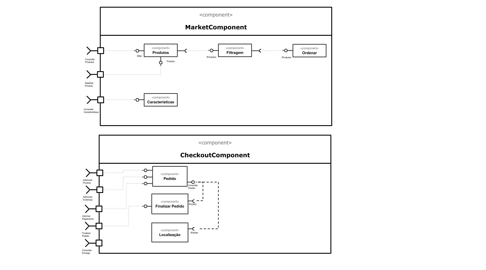

# Web como Plataforma e Subcomponentes
*Lab de Componentização e Reúso de Software 29/08/2020*

## Tarefa 1

  

## Tarefa 2

> 

> const Setvalue = () => {
>    const [name, setName] = React.useState();
>    return (
<input type="text" placeHolder="Digite um texto" onChange={(e) => setName(e.target.value)} />  <h2>{name}</h2>
)}
>
> const elemento = <Setvalue />
>
> ReactDOM.render(elemento,
>    document.getElementById("root"));
